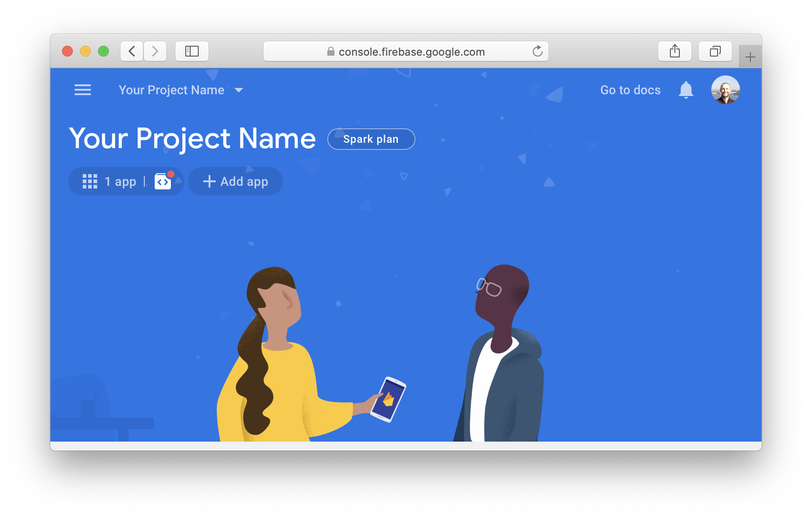
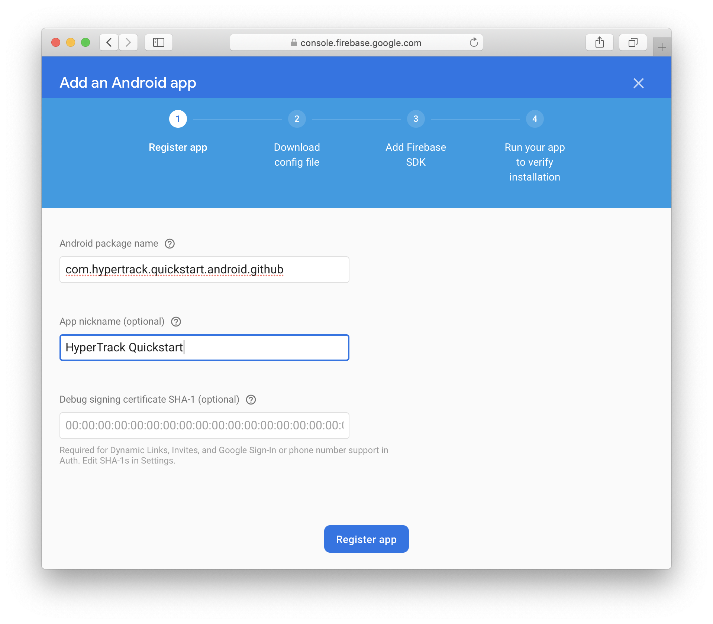
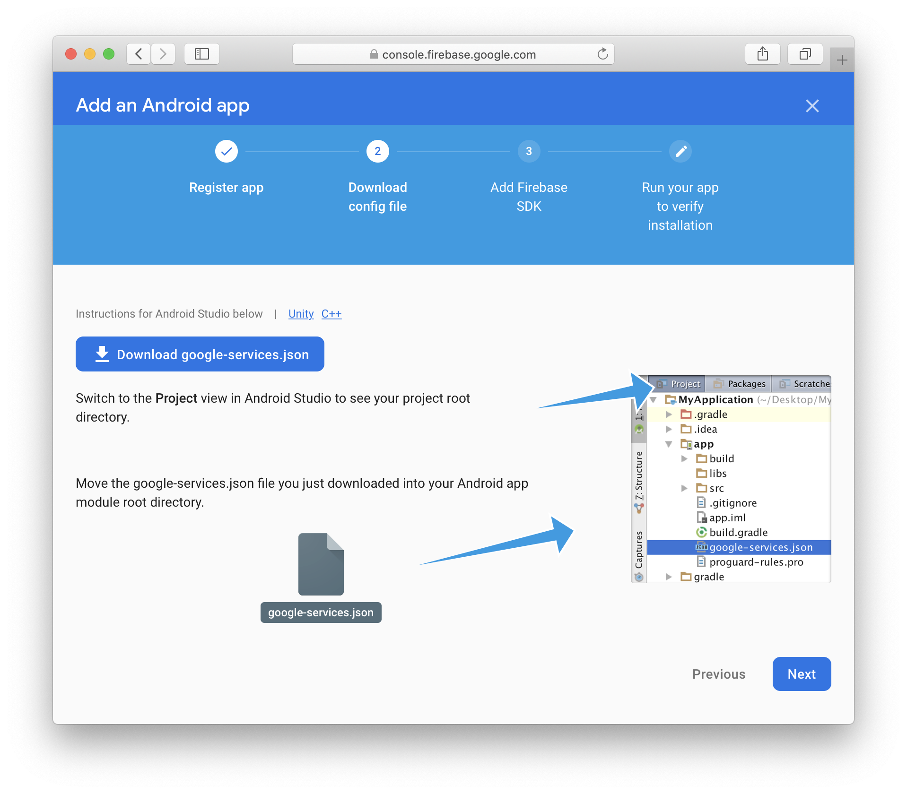
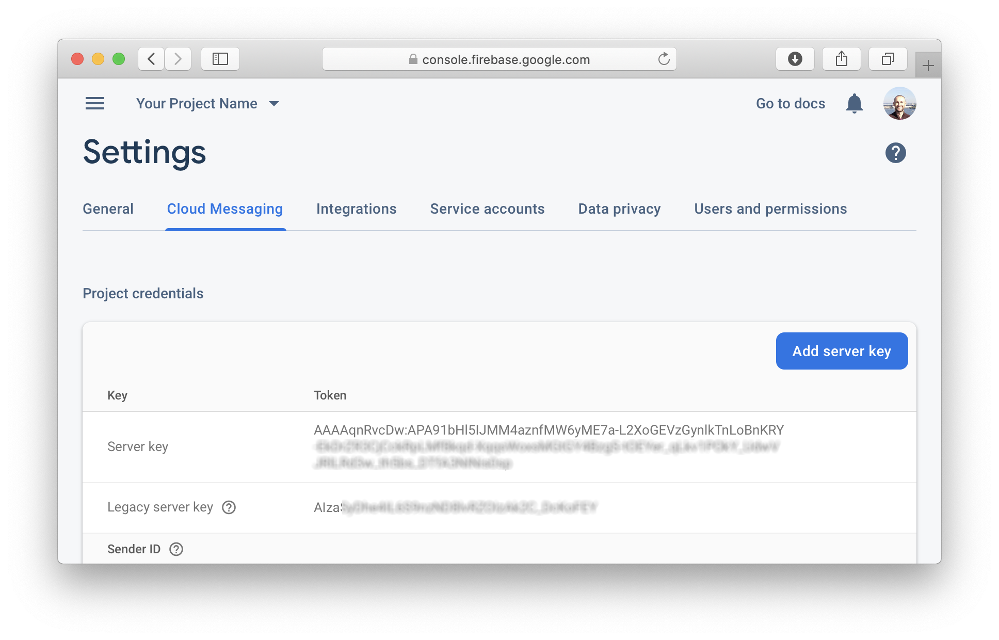
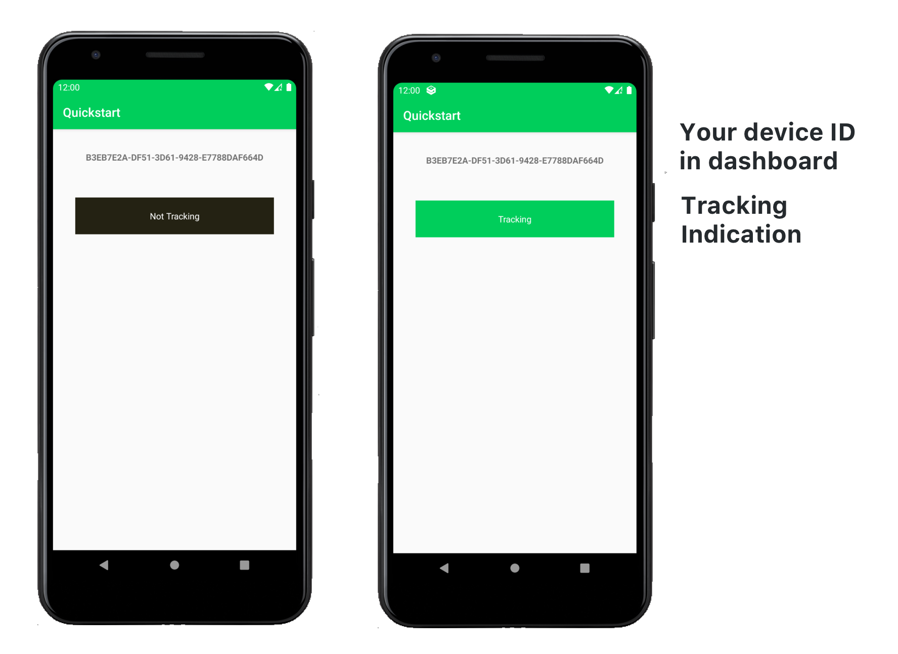

# HyperTrack Quickstart for Android SDK


[HyperTrack](https://www.hypertrack.com) lets you add live location tracking to your mobile app.
Live location is made available along with ongoing activity, tracking controls and tracking outage with reasons.
This repo contains an example Android app that has everything you need to get started in minutes.
TODO update with better language?

## Create HyperTrack Account

[Sign up](https://dashboard.hypertrack.com/signup) for HyperTrack and 
get your publishable key from the [Setup page](https://dashboard.hypertrack.com/setup).

## Clone Quickstart app

### Set your Publishable Key

Open the Quickstart project inside the workspace and set your [Publishable Key](#publishable-key) inside the placeholder
in the [`MainActivity.java`](https://github.com/hypertrack/quickstart-android/blob/9491b1fc8d8a0d4af8339552257cfda5917bda27/quickstart-java/app/src/main/java/com/hypertrack/quickstart/MainActivity.java#L16)/[`MainActivity.kt`](https://github.com/hypertrack/quickstart-android/blob/9491b1fc8d8a0d4af8339552257cfda5917bda27/quickstart-kotlin/app/src/main/java/com/hypertrack/quickstart/MainActivity.kt#L89) file.

### Set up silent push notifications

Set up silent push notifications to manage on-device tracking using HyperTrack cloud APIs from your server.

Callout: If you prefer to use your own messaging service to manage server-to-device communication, use the sync method (TODO linkd)

<details>
  <summary>Register Quickstart app in firebase</summary>
  <br/>
  <p>1. Goto <a href="https://console.firebase.google.com/">Firebase Console</a> and create test project (or you can reuse existing one)</p>
  
  <p>2. Register new Android application using <code>com.hypertrack.quickstart.android.github</code> package name.</p>
  
  <p>3. Download <code>google-services.json</code> file and copy it to <code>/quickstart-java/app</code> or <code>/quickstart-kotlin/app/</code> folder.</p>
  

</details>
Log into the HyperTrack dashboard and open the <a href="https://dashboard.hypertrack.com/setup#server_device_communication">setup page</a>.
Fill FCM Key section in Android paragraph obtained from <i>Firebase Developer console > Project Settings (gear icon at top left) > Cloud Messaging tab.</i></p>


### Run the app

Run the app on your phone and you should see the following interface:



Grant location and activity permissions when prompted.

Callout: (TODO)
HyperTrack creates a unique internal device identifier that's used as mandatory key for all HyperTrack API calls.
Please be sure to get the `device_id` from the app or the logs. The app calls
[getDeviceId](https://docs.hypertrack.com/#references-sdks-android-get-device-id) to retrieve it.

You may also set device name and metadata using the [Devices API](https://docs.hypertrack.com/#references-apis-devices)

## Start tracking

Now the app is ready to be tracked. The tracking state is controlled from the cloud and HyperTrack gives you powerful APIs
to control this from your backend.

### Tracking during specific times (e.g., during work hours)? Use the Devices API!

The simplest way to start and stop tracking is using the [Devices API](https://docs.hypertrack.com/#references-apis-devices)

To start, call the device [start](https://docs.hypertrack.com/?shell#references-apis-devices-post-devices-device_id-start) API.

```
curl -X POST \
  -u {AccountId}:{SecretKey} \
  https://v3.api.hypertrack.com/devices/{device_id}/start
```


Now you can see the tracking status of the device by calling
[GET /devices/{device_id}](https://docs.hypertrack.com/?shell#references-apis-devices-get-devices) api.

```
curl \
  -u {AccountId}:{SecretKey} \
  https://v3.api.hypertrack.com/devices/{device_id}
```

To see the device on a map, open the returned embed_url in your browser (no login required, so you can add embed these views directly to you web app).
The device will also show up in the device list in the HyperTrack dashboard.

When you are done tracking, just call the devices [stop](https://docs.hypertrack.com/?shell#references-apis-devices-post-devices-device_id-stop) api.

```
curl -X POST \
  -u {AccountId}:{SecretKey} \
  https://v3.api.hypertrack.com/devices/{device_id}/stop
```

### Going to a known place? Create a trip!

If you want to track a device while it's going to a known place, call the [trips API](https://docs.hypertrack.com/#references-apis-trips-post-trips).

Providing extra fields to the trip API allows HyperTrack to provide you with extra intelligence over the simple devices API:
* ETA of arrival with delay notifications
* Route to destination
* Shareable links to share with your customers that are limited to the trip

```curl
curl -u {AccountId}:{SecretKey} --location --request POST 'https://v3.api.hypertrack.com/trips/' \
--header 'Content-Type: application/json' \
--data-raw '{
    "device_id": "{device_id}",
    "destination": {
        "geometry": {
            "type": "Point",
            "coordinates": [{longitude}, {latitude}]
        }
    }
}'
```
To get `{longitude}` and `{latitude}` of your destination, you can use for example [Google Maps](https://support.google.com/maps/answer/18539?co=GENIE.Platform%3DDesktop&hl=en).

The return json included the embed_link to integrate to your dashboard as well as a tracking link to share with customers.

When you are done tracking this device, call [complete trips](https://docs.hypertrack.com/#references-apis-trips-post-trips-trip_id-complete) api.
```
curl -X POST \
  -u {AccountId}:{SecretKey} \
  https://v3.api.hypertrack.com/trips/{trip_id}/complete
```

### Track trips to get arrival, exit, time spent and route to geofences

HyperTrack supports a bunch of other cool ways to track and get intelligence on top of your location data. This is
outside of the quickstart. Please checkout our [docs](https://docs.hypertrack.com/) for more details.

## Dashboard

Once your app is running, go to the [dashboard](https://dashboard.hypertrack.com/devices) where you can see a list of all your devices and their live location with ongoing activity on the map.

## Documentation

You can find our [integration guide](https://docs.hypertrack.com/#guides-sdks-android) and API reference on our [documentation website](https://docs.hypertrack.com/#references-sdks-android). There is also a full in-code reference for all SDK methods.

## Support
Join our [Slack community](https://join.slack.com/t/hypertracksupport/shared_invite/enQtNDA0MDYxMzY1MDMxLTdmNDQ1ZDA1MTQxOTU2NTgwZTNiMzUyZDk0OThlMmJkNmE0ZGI2NGY2ZGRhYjY0Yzc0NTJlZWY2ZmE5ZTA2NjI) for instant responses. You can also email us at help@hypertrack.com.
