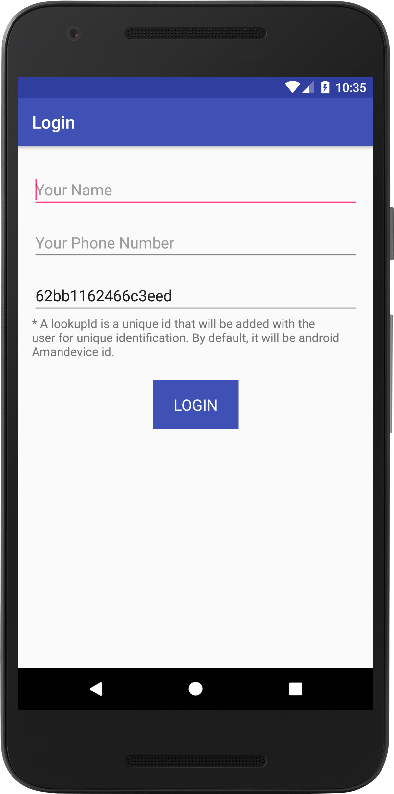
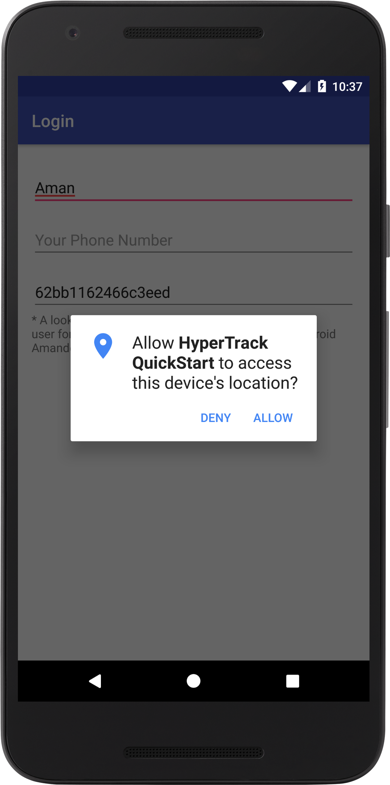

# Sample Android App using HyperTrack SDK
A simple Android application demonstrating the use of HyperTrack SDK.

HyperTrack Onboarding link: https://dashboard.hypertrack.com/onboarding/sdk/android

<p>





</p>

## Basic Setup

#### Step 1. Clone this repository
If you want to directly build the flow in your own app or wanted to create a new project, you can ignore this step.

Clone this repository
```bash
# Clone this repository
$ https://github.com/hypertrack/quickstart-android.git
```

#### Step 2. Signup and get Test Publishable key.
1. Signup [here](https://dashboard.hypertrack.com/signup).
2. Get `test` publishable key from [dashboard](https://dashboard.hypertrack.com/settings) settings page.
3. Add the test publishable key to [MyApplication](https://github.com/hypertrack/quickstart-android/blob/master/app/src/main/java/com/hypertrack/quickstart/MyApplication.java) file.

```java
HyperTrack.initialize(this.getApplicationContext(), BuildConfig.HYPERTRACK_PK);
```

#### Step 3. FCM Configuration
By default, project is configured with test FCM credentials.
Add `AAAAckZ1H20:APA91bEyilv0qgVyfSECb-jZxsgetGyKyJGVIavCOLhWn5GdI0aQBz76dPKAf5P73fVBE7OXoS5QicAV5ASrmcyhizGnNbD0DhwJPVSZaLKQrRGYH3Bam-7WGe3OEX_Chhf7CEPToVw0` as FCM server key on HyperTrack [dashboard](https://dashboard.hypertrack.com/settings).

But if you want to use your FCM configuration then replace `FCM Server Key` on HyperTrack [dashboard](https://dashboard.hypertrack.com/settings) with yours FCM server key and replace 
[google-service.json](https://github.com/hypertrack/quickstart-android/blob/master/app/google-services.json) .

## Usage

#### Step 1. Location Permission and Location Setting.
Ask for `location permission` and `location services`. Refer [here](https://docs.hypertrack.com/sdks/android/reference/hypertrack.html#boolean-checklocationpermission) for more detail.
```java
// Check for Location permission
if (!HyperTrack.checkLocationPermission(this)) {
    HyperTrack.requestPermissions(this);
    return;
}

// Check for Location settings
if (!HyperTrack.checkLocationServices(this)) {
    HyperTrack.requestLocationServices(this);
}
```

#### Step 2. Create HyperTrack User & Start Tracking
The next thing that you need to do is to create a HyperTrack user. More details about the function [here](https://docs.hypertrack.com/sdks/android/reference/user.html#getorcreate-user).

When the user is created, we need to start tracking his location and activity. Call the following method to do so ```HyperTrack.startTracking()```. Refer [here](https://docs.hypertrack.com/sdks/android/reference/hypertrack.html#void-starttracking) for more detail.

```java
// Get User details, if specified
final String name = nameText.getText().toString();
final String phoneNumber = phoneNumberText.getText().toString();
final String lookupId = !HTTextUtils.isEmpty(lookupIdText.getText().toString()) ?
        lookupIdText.getText().toString() : phoneNumber;

UserParams userParams = new UserParams().setName(name).setPhone(phoneNumber).setLookupId(lookupId);
/**
 * Get or Create a User for given lookupId on HyperTrack Server here to
 * login your user & configure HyperTrack SDK with this generated
 * HyperTrack UserId.
 * OR
 * Implement your API call for User Login and get back a HyperTrack
 * UserId from your API Server to be configured in the HyperTrack SDK.
 */
HyperTrack.getOrCreateUser(userParams, new HyperTrackCallback() {
    @Override
    public void onSuccess(@NonNull SuccessResponse successResponse) {
       
        User user = (User) successResponse.getResponseObject();
        String userId = user.getId();
        // Handle createUser success here, if required
        // HyperTrack SDK auto-configures UserId on createUser API call,
        // so no need to call HyperTrack.setUserId() API

        // On UserLogin success
        HyperTrack.startTracking();
    }

    @Override
    public void onError(@NonNull ErrorResponse errorResponse) {

        Toast.makeText(LoginActivity.this, R.string.login_error_msg + " " + errorResponse
                .getErrorMessage(), Toast.LENGTH_SHORT).show();
    }
});
```

#### Step 4. Stop Tracking
When user logs out call `HyperTracking.stopTracking()` to stop tracking the user's location and activity. Refer [here](https://docs.hypertrack.com/sdks/android/reference/hypertrack.html#void-stoptracking) for more detail.

```java
HyperTrack.stopTracking();
```

## Documentation
For detailed documentation of the APIs, customizations and what all you can build using HyperTrack, please visit the official [docs](https://docs.hypertrack.com/).

## Contribute
Feel free to clone, use, and contribute back via [pull requests](https://help.github.com/articles/about-pull-requests/). We'd love to see your pull requests - send them in! Please use the [issues tracker](https://github.com/hypertrack/quickstart-android/issues) to raise bug reports and feature requests.

We are excited to see what live location feature you build in your app using this project. Do ping us at help@hypertrack.io once you build one, and we would love to feature your app on our blog!

## Support
Join our [Slack community](http://slack.hypertrack.com) for instant responses, or interact with our growing [community](https://community.hypertrack.com). You can also email us at help@hypertrack.com.